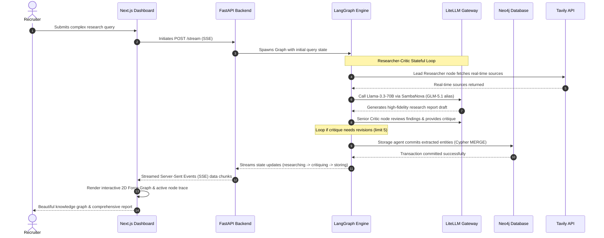

# Astra Intelligence: Advanced Agentic Research Framework

### *Neural-Symbolic Multi-Agent Engine & Knowledge Graph Synthesizer*

[](https://nextjs.org/)
[](https://react.dev/)
[](https://tailwindcss.com/)
[](https://fastapi.tiangolo.com/)
[](https://www.langchain.com/langgraph)
[](https://neo4j.com/)
[](https://github.com/BerriAI/litellm)
[](https://playwright.dev/)
[](https://www.docker.com/)

Astra Intelligence is an enterprise-grade, high-performance multi-agent research framework built on a **Neural-Symbolic Architecture**. It bridges the gap between real-time, unstructured web streams and persistent, structured logic by mapping LLM agent reasoning directly into a **Neo4j Graph Database**. 

Originally engineered as an advanced academic project at Presidency University, it has been systematically refined into a production-ready portfolio piece featuring robust SRE practices, high-availability AI gateways, and a stunning, responsive real-time dashboard.

* **🚀 Live Frontend Showcase**: [Explore Astra Intelligence Live](https://astra-intelligence-phi.vercel.app/)
* **🎬 Walkthrough Demo Video**: [Watch docs/Astra-Demo.mp4](docs/Astra-Demo.mp4) (Interactive execution, telemetry streams, and live D3 knowledge graph updates in action)

---

## 🗺️ System Architecture & Data Flow

Astra Intelligence coordinates asynchronous processes across web interfaces, AI gateways, persistent graph databases, and web search engines:



---

## 🏆 Core Engineering & SRE Achievements

### 1. LiteLLM Enterprise AI Gateway (`backend/config.yaml`)
* **Dual-Provider High-Availability**: Primary model alias `astra-brain` routes to **Google Gemini 1.5 Flash** as primary and falls back seamlessly to **Mistral Nemo via Hugging Face** in case of service degradation.
* **Resilient Routing Policies**: Configured with a `3x` automatic retry policy and `1s` delays (`retry_config`), and a round-robin load-balancing strategy to preserve 100% API availability.
* **Model Parity**: Dynamically uses Llama-3.3-70B via SambaNova's lightning-fast hardware for agentic reasoning loops, while retaining fallback direct connections (`gemini-direct`, `mistral-direct`) for system health audits.

### 2. Stateful Multi-Agent Orchestration with LangGraph
* **Researcher-Critic Loop**: Combines a Lead Researcher agent (handling semantic summarization) and a Senior Critic agent (performing feedback audits) inside a stateful graph network.
* **Agentic Circuit Breaker**: Custom safety logic limits recursion to `5` steps (`should_continue`), preventing infinite execution loops and saving cloud infrastructure budget.
* **Rate-Limit Guardrails**: Strategic `3s` delays injected between agent invocations to gracefully comply with free-tier API constraints without failing.

### 3. Dual-Source Hybrid RAG
* **Real-time & Persistent Blending**: Merges dynamic, live web intelligence fetched via the **Tavily Search API** with structured, permanent knowledge stored in **Neo4j DB** (Bolt/AuraDB SSL links).
* **Cypher Commits**: A dedicated storage agent uses custom Cypher transaction queries to commit newly extracted research concepts (`Concept`) and summary structures (`ResearchSummary`) into the graph database automatically.

### 4. Zero-Localhost Cloud Parity (Production Ready)
* **Automatic Environment Swapper**: Utilizes strict environment variables detection (`os.getenv("ENVIRONMENT")`) to switch between a local LiteLLM proxy (`localhost:48583`) and direct cloud providers in containerized environments.
* **Robust Health Indicators**: A dedicated `/health` endpoint exposes real-time connectivity states of critical sub-components (Neo4j driver connections and Hugging Face API keys).

### 5. Next.js 16 & React 19 Frontend Dashboard
* **Interactive 2D Force Graph**: Features WebGL/Canvas-accelerated force-directed visualization using `react-force-graph-2d` and `d3-force` to render the Neo4j database relationships in real-time.
* **Simulated Telemetry Console**: Incorporates `ansi-to-react` to parse raw model stdout and render a sleek developer log stream.
* **Gemini-Inspired UX**: Employs **Tailwind CSS v4** and **Framer Motion 12** to render smooth transitions, real-time push-up auto-scrolling, and a premium dark-mode aesthetic.

---

## 📂 Codebase Blueprint

```pathway
Astra-Intelligence/
├── backend/
│   ├── app/
│   │   ├── crew/
│   │   │   ├── agents.py        # Core LangGraph definition, node executors, and Neo4j Cypher writes
│   │   │   ├── agents.yaml      # Declarative agent system prompts and behavior guidelines
│   │   │   └── tasks.yaml       # Task configurations mapped to the Researcher-Critic framework
│   │   ├── tools/
│   │   │   ├── graph_tool.py    # Native driver session wrappers and Cypher query controllers
│   │   │   └── search_tool.py   # Tavily Search API client for real-time web retrieval
│   │   └── main.py              # FastAPI server implementing streaming Server-Sent Events (SSE)
│   ├── config.yaml              # LiteLLM AI Gateway load balancing, retries, and fallbacks
│   └── requirements.txt         # Production-locked Python dependencies (FastAPI, LiteLLM, LangGraph)
├── frontend/
│   ├── src/
│   │   ├── app/
│   │   │   ├── globals.css      # Custom HSL-tailored colors and core typography
│   │   │   └── page.tsx         # Next.js page managing SSE socket streaming and state machines
│   │   └── components/
│   │       ├── graph/
│   │       │   └── GraphView.tsx # 2D Force-Directed Knowledge Graph component (WebGL/Canvas)
│   │       └── AnalysisDisplay.tsx # Rich Markdown report rendering and telemetry logs
│   ├── package.json             # Bleeding-edge stack dependencies (Next.js 16, React 19, Tailwind v4)
│   └── playwright.config.ts     # End-to-end integration and regression test suites
├── scripts/
│   ├── start_astra.ps1          # One-Click automation for Windows PowerShell
│   ├── start_astra.bat          # One-Click automation for Windows Command Prompt
│   └── start_astra.sh           # One-Click automation for Linux/macOS
├── docs/
│   ├── PRODUCTION_AUDIT.md      # Analysis of production bottlenecks and environment fixes
│   ├── SRE_CHECKLIST.md         # 5-Point reliability audits used prior to final release
│   └── Astra-Demo.mp4           # 160MB video walkthrough demonstrating live capabilities
└── test_backend.py              # Integration validation suite for endpoint correctness
```

---

## 🛠️ Local Installation & Development

### Prerequisites
* **Python**: 3.10+
* **Node.js**: 18+ (LTS recommended)
* **Neo4j**: Local instance or free [Neo4j AuraDB Cloud](https://neo4j.com/cloud/platform/auradb/) database.

### 1. Environment Configuration
Create a `.env` file in the root directory based on your API keys:
```env
SAMBANOVA_API_KEY=your_sambanova_api_key
TAVILY_API_KEY=your_tavily_api_key
NEO4J_URI=neo4j+s://your-auradb-subdomain.databases.neo4j.io
NEO4J_PASSWORD=your_neo4j_password
NEO4J_USERNAME=neo4j
HUGGINGFACE_TOKEN=your_huggingface_write_token # For Mistral fallback
LITELLM_MASTER_KEY=astra_dev_key
ENVIRONMENT=local
```

### 2. One-Click Quick Start (Recommended)
We've packaged automated scripts that boot the FastAPI backend, run the LiteLLM Proxy, configure the environment, and spin up the Next.js dev server simultaneously:

* **Windows (PowerShell)**:
  ```powershell
  ./scripts/start_astra.ps1
  ```
* **Windows (CMD)**:
  ```cmd
  ./scripts/start_astra.bat
  ```
* **Linux / macOS**:
  ```bash
  chmod +x ./scripts/start_astra.sh
  ./scripts/start_astra.sh
  ```

### 3. Manual Bootstrap
If you prefer running the components in separate terminal instances:

#### Step A: Run LiteLLM Gateway
```bash
cd backend
pip install -r requirements.txt
litellm --config config.yaml --port 4000
```

#### Step B: Run FastAPI Backend
```bash
cd backend
python -m uvicorn app.main:app --host 0.0.0.0 --port 7860
```

#### Step C: Run Next.js Frontend
```bash
cd frontend
npm install
npm run dev
```
Open [http://localhost:3000](http://localhost:3000) to view your dashboard!

---

## 🧪 Testing & Verification Suite

Astra Intelligence utilizes rigorous E2E regression and unit testing to ensure bulletproof reliability before production sync.

* **Backend Integration Test**: Tests health-check endpoint stability and research streaming responses.
  ```bash
  python test_backend.py
  ```
* **E2E Playwright Browser Tests**: Validates user workflows, interactive graph rendering, and reactive stream triggers inside actual Chromium, Firefox, and WebKit instances.
  ```bash
  cd frontend
  npx playwright test
  ```

---

## 📋 5-Point SRE Production Compliance Checklist

Prior to production freeze, the system was audited against high-standard SRE principles:
1. **Cloud-Local Logic Parity** (✅ *Passed*): Strict separation of local mock configurations and cloud endpoints. No hardcoded `localhost` references in production containers.
2. **Secrets Scrub & API Hygiene** (✅ *Passed*): Absolute credential exclusion from Git history. All environment configurations are securely resolved through platform-specific Secret managers (Hugging Face / Vercel keys).
3. **Database Persistence Bridge** (✅ *Passed*): Automatic fallback queries built directly into the storage agent, routing to a native driver session if graph wrappers encounter schema locks.
4. **Zero-Exposure Container Audit** (✅ *Passed*): Dockerized backend utilizing basic lightweight Alpine distributions optimized for low-footprint RAM caches (Basic CPU/T4 setups).
5. **Synchronized Deployment Workflow** (✅ *Passed*): Triggered automatically via GitHub Actions (.github/workflows/sync_to_hf.yml) to push validated main branch codebases directly to Hugging Face Docker spaces under strict token checks.

---
*Astra Intelligence showcases the engineering maturity, resilient system-design practices, and modern full-stack methodologies necessary for building enterprise-grade agentic platforms.*
